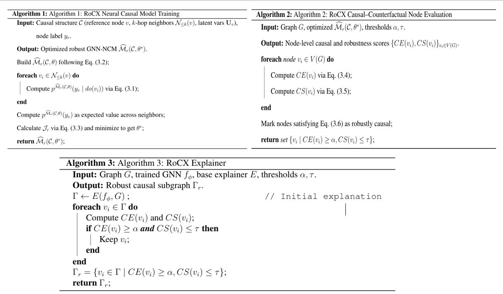
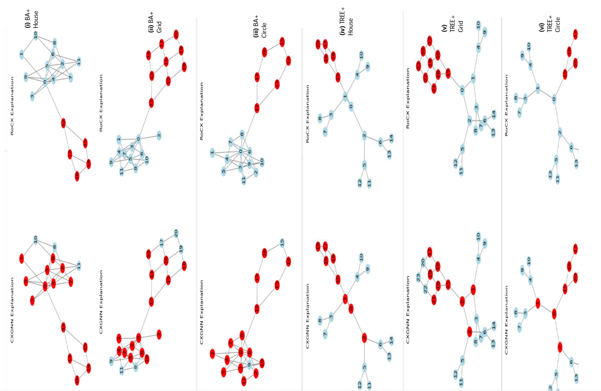

  

# RoCX — Integrating Causality and Counterfactual Reasoning for Robust and Explainable Graph Neural Networks.

**RoCX** is a framework that combines **causality, counterfactual reasoning, and structural analysis** to produce robust and interpretable explanations for graph neural network predictions on a wide range of graph types.

This repository accompanies the **RoCX Master’s Thesis** and includes:
- Core causal graph construction logic
- Molecular graph parsing from SMILES
- Interactive visualization via Streamlit
- A deployable causal explanation demo

---

## 🎓 Academic Context

This project is developed as part of a **Master’s thesis in Data Science & Artificial Intelligence (ECE Paris)**.

**Thesis title**  
> *RoCX: Integrating Causality and Counterfactual Reasoning for Robust and Explainable Graph Neural Networks*

The work is inspired by recent advances in:
- Causal inference (Pearl, 2018)
- Graph-based explainability
- Molecular representation learning

---

## 🔍 Motivation
Modern graph-based models (e.g., GNNs) often achieve **high predictive accuracy** but **lack causal interpretability**, relying primarily on correlation-based explanations.

RoCX addresses this limitation by:
- Moving beyond correlation-based explanations
- Explicitly modeling **cause–effect relationships** between graph components
- Identifying **human-interpretable causal subgraphs** that drive model predictions
- Enabling **interactive inspection** and reasoning over causal graph structures.

## 🧠 Core Contributions

- Introduction of **RoCX**, a counterfactual reasoning framework for graph-structured data
- Construction of **causal graphs from molecular SMILES** and identification of **structural causal relationships** between atoms
- Generation of **interpretable explanations** via **causal subgraph visualizations**
- **Training and validation on synthetic Barabási–Albert (BA) graphs** to learn causal reasoning under controlled conditions
- **Evaluation on real-world molecular datasets**, demonstrating generalization and practical applicability in chemical domains
- Implementation of a fully interactive **Streamlit application** with a **modular architecture** separating data handling, causal logic, and visualization

## 🧪 Method Overview

RoCX follows a structured pipeline aligned with its causal–counterfactual formulation,
first trained on synthetic Barabási–Albert (BA) graphs and subsequently evaluated on
real-world molecular graphs.

1. **Graph Representation & Prediction**
   - Represent input data as graphs \( G = (V, E) \)
   - Apply a trained GNN \( f_\phi \) to obtain graph or node-level predictions

2. **Causal–Counterfactual Representation Learning**
   - Construct a causal structure \( C(G) \) from graph topology
   - Learn a GNN-based Neural Causal Model \( M(C, \theta) \) capturing interventional dependencies
   - Pretrain and validate causal reasoning using synthetic BA graphs

3. **Causal Effect & Robustness Estimation**
   - Compute node-level causal effects via do-calculus interventions
   - Evaluate counterfactual sensitivity under controlled perturbations
   - Apply robustness weighting to identify stable causal contributors

4. **Robust Subgraph Extraction & Visualization**
   - Extract the causal and counterfactually robust explanatory subgraph \( \Gamma_r \)
   - Visualize causal attributions and subgraphs using NetworkX and Matplotlib
   - Enable interactive exploration through a Streamlit interface

   

## 🖥️ Streamlit Application

The interactive Streamlit app allows users to explore RoCX explanations for molecular graphs:

- Upload molecular datasets (`.npz`)
- Randomly sample molecules for inspection
- Visualize causal and counterfactually robust subgraphs
- Inspect node-level and bond-level contributions to predictions

The app directly reflects the RoCX pipeline, showing how causal effects and robustness weighting generate interpretable molecular explanations.

## 📊 Results & Observations

### Synthetic BA Graph Experiments

- RoCX is first trained and validated on **synthetic Barabási–Albert (BA) graphs** to verify that it can recover causal structure under controlled conditions.  
- Node-level causal contributions and counterfactual robustness are accurately identified, demonstrating the reliability of the GNN-NCM model before applying it to real-world data.  
- These experiments confirm that the method can distinguish true causal nodes from spurious correlations in a controlled graph setting.

  

### Molecular Case Studies

- RoCX identifies **causal and counterfactually robust subgraphs**, highlighting chemically meaningful motifs in molecular graphs.  
- Node- and bond-level explanations reflect **GNN-NCM learned causal contributions**, weighted by robustness, ensuring stable interpretations under perturbations.  
- Explanations align with known molecular functional groups and structural motifs.  
- Graph-level causality and counterfactual reasoning significantly improve interpretability compared to black-box methods.  

  

📚 Related Work
- Behnam, A., & Wang, B. (2024, September). Graph neural network causal explanation via neural causal models. In European Conference on Computer Vision (pp. 410-427). Cham: Springer Nature Switzerland.
- Pearl, J. The Book of Why, 2018.
- Agarwal et al., Evaluating Explainability for GNNs, 2023.
- Geiger et al., Inducing Causal Structure for Neural Networks, ICML 2022
- Luo et al., Parameterized Explainer for GNNs, NeurIPS 2020

👤 Author

Amadou Kindy Barry
MSc Data Science & AI — ECE Paris
-🔗 LinkedIn: https://www.linkedin.com/in/amadou-kindy-barry
-💻 GitHub: https://github.com/amadou086

